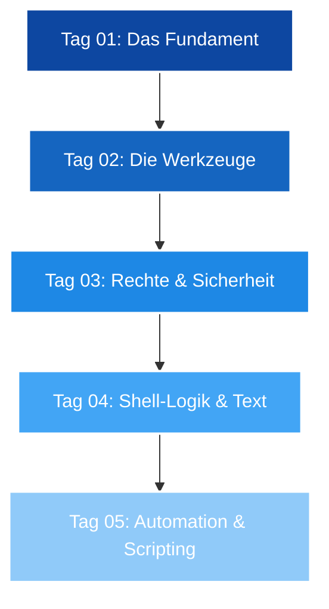

# 🌌 Linux Essentials - Das Master-Repository

Willkommen im zentralen Hub für die Linux-Essentials-Serie. Dieses Repository dient als strukturierte Wissensbasis und Kursbegleiter für den Weg zum Linux-Profi.

---

## 🗺 Kurs-Roadmap & Lernpfad

---

## 📂 Kursmodule (ToC)

Hier findest du die detaillierten Unterlagen zu den einzelnen Schulungstagen:

### 📅 Woche 1: Grundlagen
| Modul | Status | Fokus-Themen | Link |
| :--- | :---: | :--- | :--- |
| **Tag 01** | ✅ | Shell-Einführung, FHS, Historie | [📖 README](./Day_01/readme.md) |
| **Tag 02** | ✅ | Hilfe-Systeme, Hardware, Fortg. Datei-OPs | [📖 README](./Day_02/README.md) |
| **Tag 03** | ✅ | CUPS, Shell-Konfig, Aliases, Redirects | [📖 README](./Day_03/README.md) |
| **Tag 04** | ✅ | Wildcards, Text-Tools (tr, cut), Logik | [📖 README](./Day_04/README.md) |
| **Tag 05** | ⏳ | TBD | [📖 README](./Day_05/readme.md) |

### 📅 Woche 2: Administration
| Modul | Status | Fokus-Themen | Link |
| :--- | :---: | :--- | :--- |
| **Tag 06** | ⏳ | TBD | [📖 README](./Day_06/README.md) |
| **Tag 07** | ⏳ | TBD | [📖 README](./Day_07/README.md) |
| **Tag 08** | ⏳ | TBD | [📖 README](./Day_08/README.md) |
| **Tag 09** | ⏳ | TBD | [📖 README](./Day_09/README.md) |
| **Tag 10** | ⏳ | TBD | [📖 README](./Day_10/README.md) |

### 📅 Woche 3: Speicher & Dateisysteme
| Modul | Status | Fokus-Themen | Link |
| :--- | :---: | :--- | :--- |
| **Tag 11** | ⏳ | TBD | [📖 README](./Day_11/README.md) |
| **Tag 12** | ⏳ | TBD | [📖 README](./Day_12/README.md) |
| **Tag 13** | ⏳ | TBD | [📖 README](./Day_13/README.md) |
| **Tag 14** | ⏳ | TBD | [📖 README](./Day_14/README.md) |
| **Tag 15** | ⏳ | TBD | [📖 README](./Day_15/README.md) |

### 📅 Woche 4-6: Fortgeschrittene Themen (WIP)
| Modul | Status | Link |
| :--- | :---: | :--- |
| **Tag 16 - 20** | ⏳ | [In Planung](./Day_16/README.md) |
| **Tag 21 - 25** | ⏳ | [In Planung](./Day_21/README.md) |
| **Tag 26 - 30** | ⏳ | [In Planung](./Day_26/README.md) |

---

## 🧠 Zentrale Wissensbasis (Reference)

Hier sind die essenziellen Informationen zusammengefasst, die über alle Kurstage hinweg relevant sind.

<b>📜 Distributionen & Architektur</b> (Klicken zum Ausklappen)

### Linux Hauptfamilien
| Familie | Fokus | Paketmanager | Vertreter |
| :--- | :--- | :--- | :--- |
| **Debian** | Stabilität | APT | Ubuntu, Mint, Kali |
| **Red Hat** | Enterprise | DNF | RHEL, Rocky, Fedora |
| **Arch** | Minimalismus | Pacman | Manjaro, Endeavour |
| **SUSE** | Business | Zypper | openSUSE |

### Release Modelle
* **LTS (Long Term Support):** Fokus auf Stabilität (z.B. Rocky Linux, Debian).
* **RR (Rolling Release):** Stets aktuellste Software (z.B. Arch Linux).

<b>🏗 Filesystem Hierarchy Standard (FHS)</b> (Klicken zum Ausklappen)

| Verzeichnis | Zweck |
| :--- | :--- |
| `/bin` / `/sbin` | Essenzielle Binärdateien. |
| `/etc` | Konfigurationen. |
| `/var` | Variable Daten (Logs, Datenbanken). |
| `/proc` / `/sys` | Virtuelle Dateisysteme (Kernel-Infos). |
| `/home` / `/root` | Benutzerdaten. |

<b>🛡 Dateirechte & Besitz (Demnächst...)</b> (Klicken zum Ausklappen)

Diese Themen werden in Kürze vertieft:
* `chmod`: Ändern von Zugriffsrechten (Oktal vs. Symbolisch).
* `chown`: Ändern von Besitzverhältnissen.
* **SUID/SGID & Sticky Bit:** Fortgeschrittene Berechtigungen.

<b>🤖 Virtualisierung & Container</b> (Klicken zum Ausklappen)

* **Hypervisor Typ 1:** Bare Metal (Proxmox, ESXi).
* **Hypervisor Typ 2:** Gehostet (VirtualBox, VMware).
* **Container:** Isolierte Anwendungen (Docker, Podman).

---

## 🛠 Schnellzugriff: Wichtige Befehle

> [!TIP]
> Drücke `Strg + F` in dieser README, um schnell nach Befehlen zu suchen.

| Kategorie | Top-Befehle |
| :--- | :--- |
| **Navigation** | `cd`, `ls`, `pwd`, `tree` |
| **Info** | `uname`, `lscpu`, `free`, `df`, `id` |
| **Hilfe** | `man`, `info`, `whatis`, `--help` |
| **Manipulation** | `mkdir`, `cp`, `mv`, `rm`, `touch` |
| **Text** | `cat`, `less`, `grep`, `diff`, `nano` |

---

## 📈 System-Status (Dashboard)
* **Aktuelle Umgebung:** Rocky Linux 9.x (RHEL-basiert)
* **Shell:** Bash / ZSH + Oh My Zsh (Konfiguriert)
* **Fortschritt:** 13% (4 von 30 Modulen abgeschlossen)

---

*Dieses Repository wird kontinuierlich gepflegt. Letztes Update: 08. Mai 2026.*
